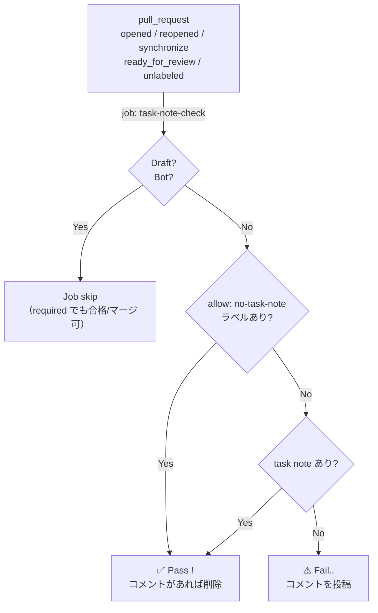

# PR に task note 追加があるかを CI で検知

## Overview

PR に task note 追加を入れ忘れるのを防ぐ。CI で task note 追加の有無を検知し、無ければ PR をブロックする（意図的に不要な場合は `allow: no-task-note` ラベルでオプトアウト）。

---

## Details

### ワークフロー設計
- 複数ルール追加に対応。1ルール1job。Draft, Botの条件フラグはJobごとに自由に設定可能。
- コメントは marker（不可視の HTML コメント）で自分のものを一意特定し、fail で upsert、pass で削除。
- コメントロジックは composite action `.github/actions/pr-policy-comment` に切り出し、将来のルール追加で再利用できるようにした。ローカル action なので前段に `.github/actions` の sparse-checkout が必須。
- トリガー選定: `opened` で直接 ready も拾う。`unlabeled` は opt-out ラベル除去での自動再評価用（外したのに合格のまま＝stale green を防ぐ）。`labeled` はノイズになりそうなので入れなかった。

### task-note-check フロー

### 補足
- マージブロックは branch protection で `PR Policy / task-note-check` を required 指定して初めて効く（CI 単体ではブロックできない）。
- `gh`・Web UI・設定のいずれにも「PR を draft 既定/強制」にする口は無い
- AGENTS.md には PR を必ず draft で作成することを明記。
- 集約コメント: 複数ルール実行時に、コメント集約が要るなら集約 job が要るが、PR下部のCI jobの一覧の行数が増えて見辛くなるので避けた。`workflow_run` で別ワークフローを作る案もあったが、ややこしいので辞めた。

---

## Operation

### Task 1

- `.github/workflows/pr-policy-check.yml`（1 ジョブ `task-note-check`）と composite action `.github/actions/pr-policy-comment` を追加。

### Task 2

- `allow: no-task-note` ラベルを作成。
- branch protection で `PR Policy / task-note-check` を required に指定。
